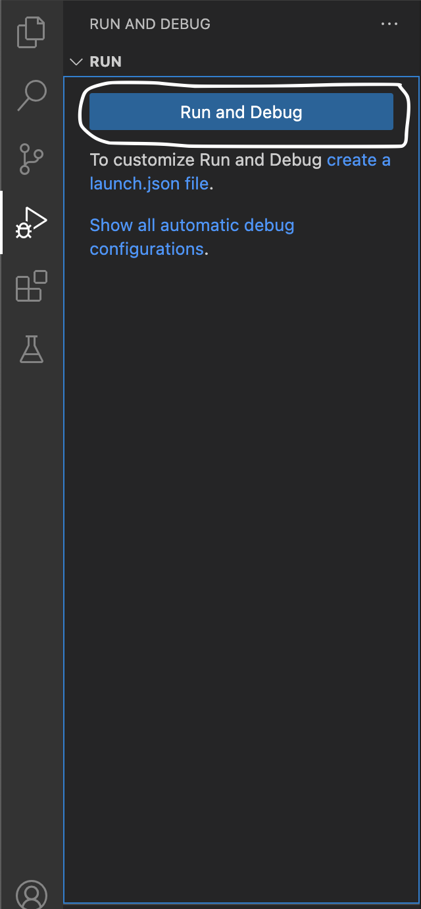
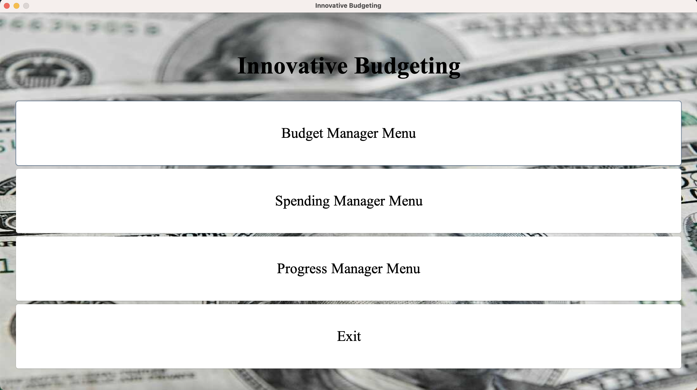
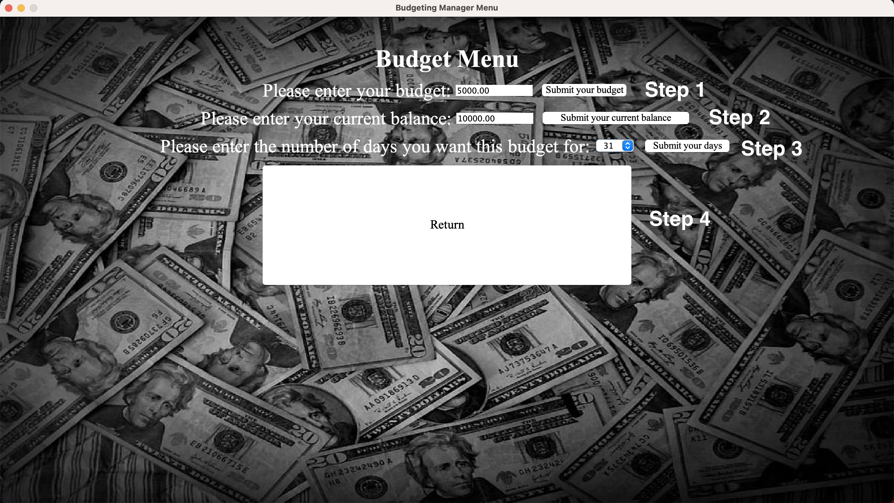
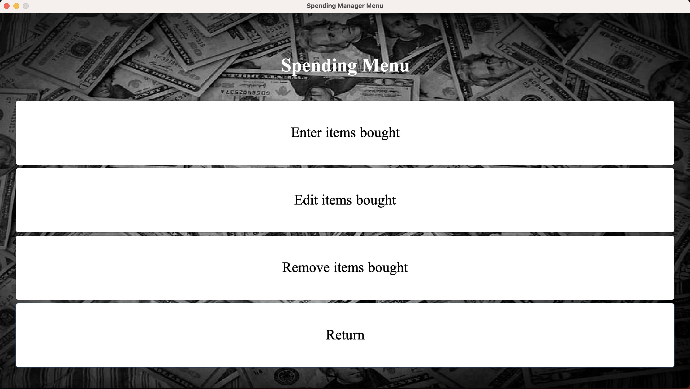
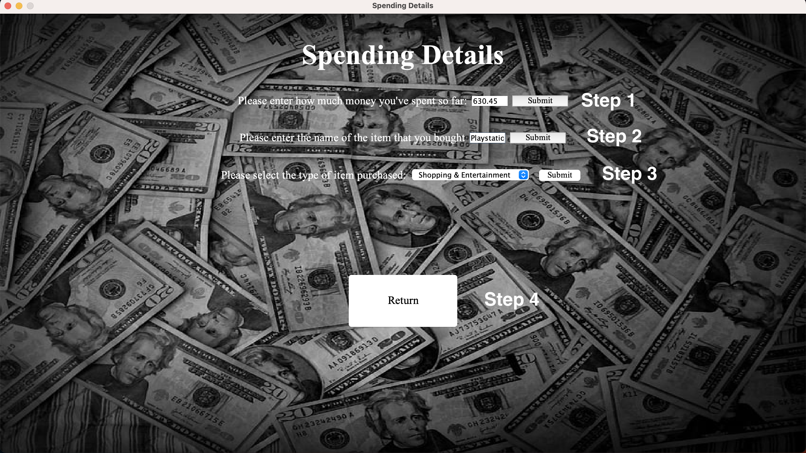
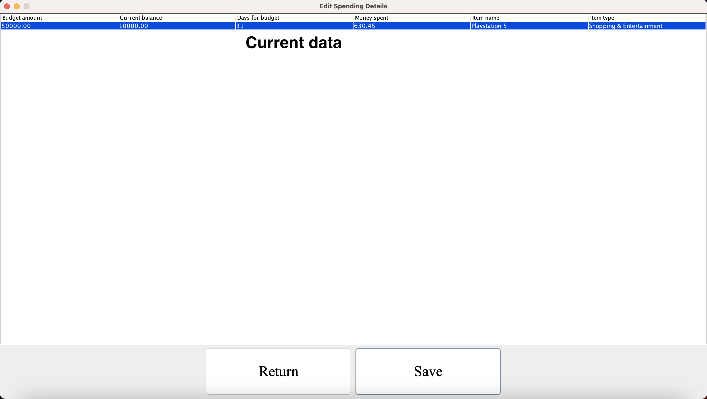
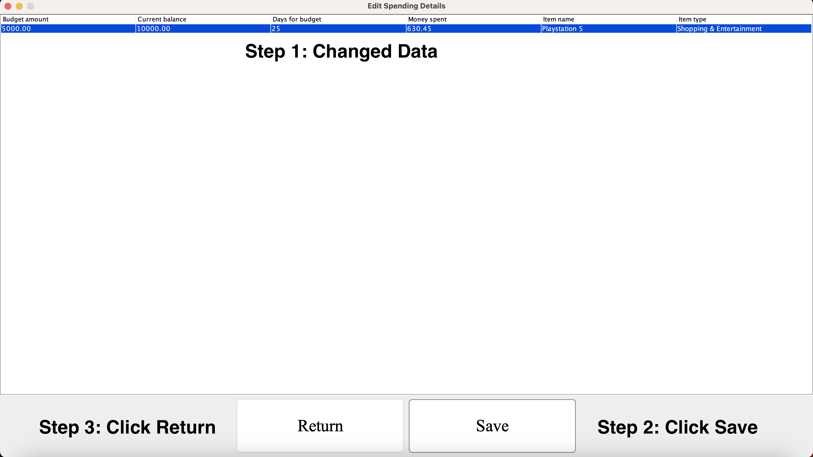
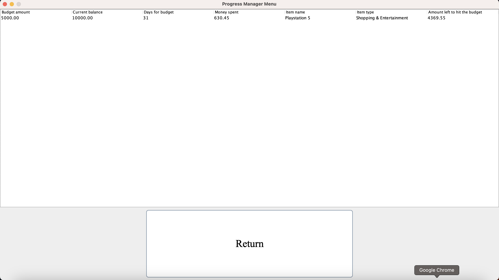
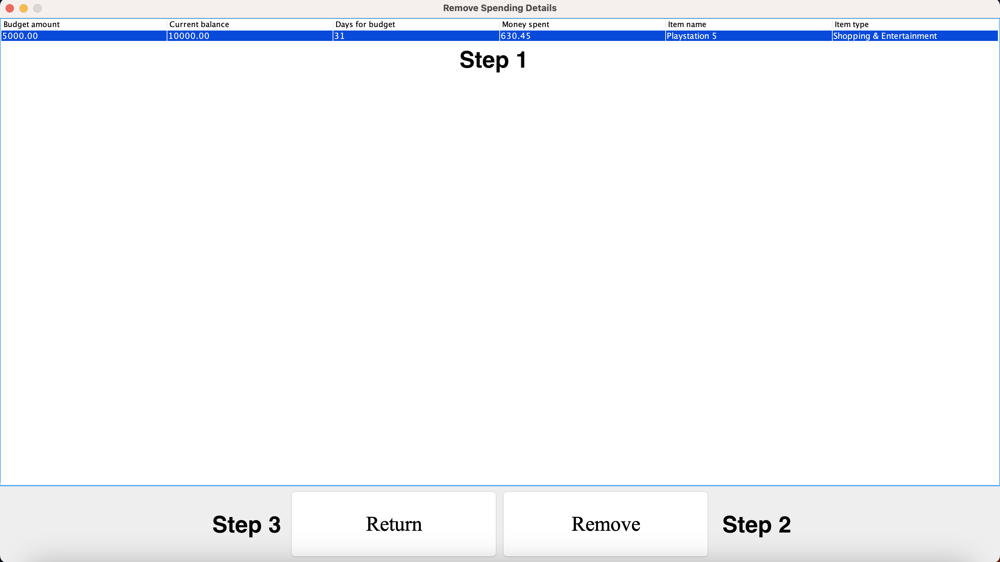
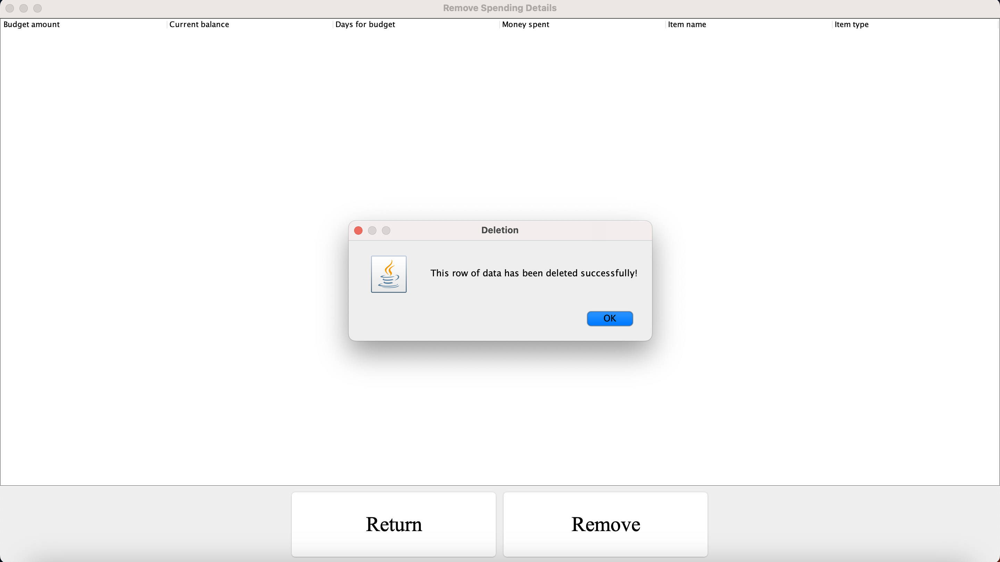

<h1>Budgeting Program Final Project</h1>

Hello, welcome to my project I created during this semester for this class! This is a Budget Program to provide assistance to those struggling with properly budgeting and managing their money.

Firstly, please download the ZIP file in Github by pressing the green "<> Code" button and then selecting "Download ZIP", and then extract the file and open it in your preffered IDE, and begin by running the file here's an example using Visual Studio Code

<h2>How to use</h2>

Now, please use these steps in the order given to make sure the program runs and works properly as intended. Firstly, once you run the program you should see the Main Menu appear

Firstly, click on the "Budget Manager Menu" button and enter in the information in order "Please enter your budget" -> "Please enter your current balance" -> "Please enter the number of days you want this budget for". Also, when you enter your budget and balance they should be either an Integer or a Double. Click the buttons to submit your input. After you complete these steps please click the "Return" button to return to the Main Menu.

After going back to the Main Menu please click on the "Spending Manager Menu" button to open the Spending Menu

Once this is completed you'll have 3 buttons to choose from, firstly select "Enter Items Bought", where you'll open the window to input details on what you've spent so far, please input your information and click the submit buttons in this order, "Please enter how much money you've spent so far" (Can be either Integer or Double) -> "Please enter the name of the item you purchased" (If you have multiple items you can separate them with a comma: Playstation 5, Shoes) -> "Please select the type of item you purchased" -> "Return" 

 Now, after you click Return in the "Enter Items Bought" window please click the "Edit items bought" button which will display a table with your inputted information. Say you inputted something wrong and want to edit it, well this functionality completes that. A table will appear and if you want to make changes to the inputted information, please select the individual cell that contains the data and change the data for example, if you want to change the "Days for Budget" from 31 to 25 please select the cell that contains 31 by double clicking, type in 25, and once you make the changes, on your keyboard please press "Enter" if on Windows or "return" on Mac to complete it. Then select "Save" then "Return" to go back to the Spending Menu Window

Now, you'll be back to the Spending Menu, please go even further back to the Main Menu. Once there please click on "Progress Menu Manager". This will display all the information the user inputted and also include an additional column called "Amount left to hit the budget" which will display to the user how close they are to hitting their budget and calcualtions are performed to complete this. Once you're finished viewing this information click the "Return" button to return to the Main Menu

Say you've completed all this and now you don't really need this information anymore and want it to be deleted, there's a functionality that performs this. In the Main Menu please select "Spending Manager Menu" -> "Remove items bought". A table will be displayed with the information you inputted, to delete a row of information please select the row by clicking on it and making sure it's highlighted blue, and select the "Remove" button Once you do that you'll see a popup display telling you that the data has been removed and the table will now be empty, then click return, and return again to return to the Main Menu

If you would like to enter more data please select the "Exit" button that appears in the Main Menu and restart the program and complete the above steps in order again. That is all for my project, thank you!

